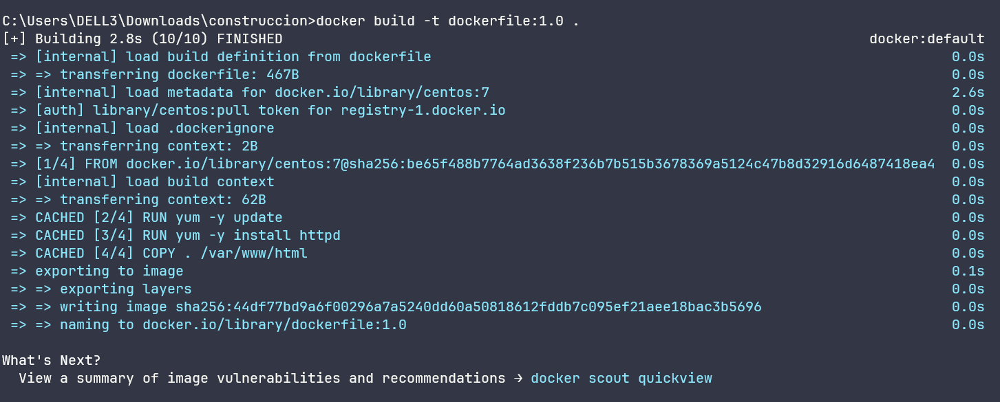
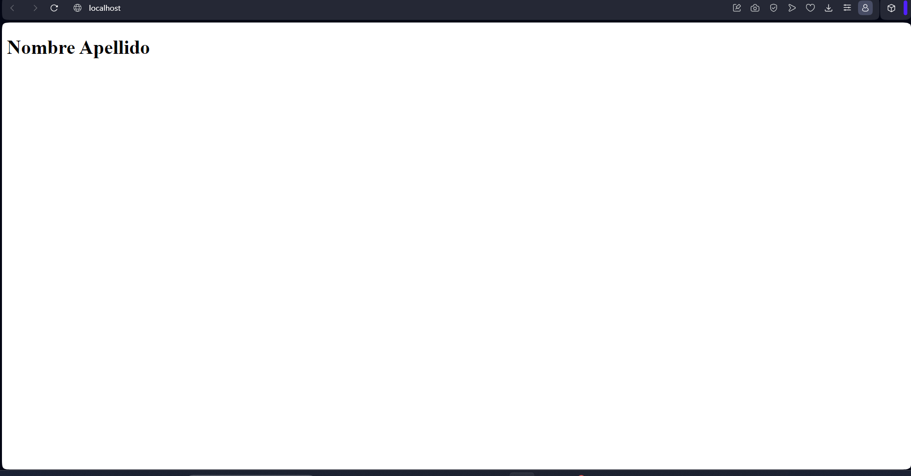

# Dockerfile
Un Dockerfile es un archivo de texto plano que contiene una serie de instrucciones que Docker utiliza para construir una imagen de contenedor Docker. Este conjunto de instrucciones define cómo se debe configurar y construir una imagen de contenedor, incluyendo qué sistema operativo base usar, qué software instalar, qué archivos copiar en el contenedor y cómo configurar el entorno de ejecución.
Las instrucciones en un Dockerfile son simples y están diseñadas para ser leídas y comprendidas fácilmente. 

### FROM 
Esta instrucción especifica la imagen base que se utilizará como punto de partida para construir la nueva imagen de Docker. Por ejemplo, FROM nginx:alpine significa que la nueva imagen se basará en la imagen oficial de Nginx que está etiquetada como "alpine". Al utilizar una imagen base existente, se heredan todas las configuraciones y software incluidos en esa imagen, lo que facilita la creación de nuevas imágenes sin tener que empezar desde cero.

### RUN
La instrucción RUN ejecuta comandos en el contenedor durante el proceso de construcción de la imagen. Puedes usar esta instrucción para instalar software, configurar el entorno, o realizar cualquier otra tarea necesaria para preparar la imagen. Por ejemplo, RUN apt-get update && apt-get install -y <paquete> instalará un paquete utilizando el administrador de paquetes apt en una imagen basada en Ubuntu.

### COPY
Esta instrucción copia archivos o directorios desde la máquina host al sistema de archivos del contenedor. Se utiliza para agregar archivos, scripts u otros recursos necesarios para la aplicación en la imagen de contenedor. Por ejemplo, COPY ./mi-app /app copiará el directorio mi-app desde la máquina host al directorio /app en el contenedor.

### ADD
Esta instrucción copia archivos o directorios desde el sistema de archivos de la máquina host al sistema de archivos del contenedor. Aunque es similar a la instrucción COPY, ADD tiene algunas características adicionales, como la capacidad de descomprimir automáticamente archivos y de copiar archivos desde una URL remota.

### CMD 
Esta instrucción define el comando predeterminado que se ejecutará cuando se inicie el contenedor. Puede haber solo una instrucción CMD en un Dockerfile. Si se proporciona más de una, solo la última tendrá efecto. Por ejemplo, CMD ["nginx", "-g", "daemon off;"] ejecutará el servidor web Nginx en modo daemon cuando se inicie el contenedor.

### ENTRYPOINT
Esta instrucción se utiliza para configurar el comando o el script que se ejecutará cuando se inicie un contenedor basado en la imagen. A diferencia de la instrucción CMD, que especifica el comando predeterminado que se ejecutará y que puede ser sobrescrito desde la línea de comandos al iniciar el contenedor, ENTRYPOINT establece un comando que no se puede sobrescribir fácilmente al iniciar el contenedor.
Es importante destacar que, si se proporciona un comando en la línea de comandos al iniciar el contenedor (por ejemplo, docker run <imagen> <comando>), este comando se agregará como argumentos al comando especificado en ENTRYPOINT, en lugar de sobrescribirlo. Esto permite que el contenedor sea más versátil y se adapte a diferentes necesidades de uso.

### EXPOSE
Esta instrucción informa a Docker que el contenedor escuchará en un puerto específico en tiempo de ejecución. No abre realmente el puerto, solo documenta que la aplicación dentro del contenedor puede usar dicho puerto. Por ejemplo, EXPOSE 80 expone el puerto 80 en el contenedor, lo que permite que se acceda a la aplicación que se esté ejecutando en ese puerto desde fuera del contenedor.

### ENV
Esta instrucción se utiliza para definir variables de entorno dentro del contenedor. Las variables de entorno definidas con ENV estarán disponibles para cualquier proceso en el contenedor durante su ejecución. Por ejemplo, ENV MYSQL_ROOT_PASSWORD=password define una variable de entorno llamada MYSQL_ROOT_PASSWORD con el valor password.

##  Para construir una imagen de Docker a partir de un Dockerfile
```
docker build -t <nombre imagen>:<version> .
```
La opción -t se utiliza para etiquetar la imagen que se está construyendo con un nombre y una versión. <nombre_imagen> es el nombre que le quieres dar a la imagen, y <version> es la versión. Por ejemplo, myapp:1.0.
*.* Este punto indica al comando docker build que busque el Dockerfile en el directorio actual. Especifica la ubicación del contexto de la construcción, que incluye el Dockerfile y cualquier otro archivo necesario para la construcción de la imagen.


### Colocar las siguientes instrucciones en un Dockerfile
1. Instalar el sistema operativo centos 7
2. Actualizar el sistema operativo
3. Instalar apache
4. Copiar los archivos desde ./web a /var/www/html
5. Exponer el puerto 80
6. Ejecutar apache


- apachectl: Es el script de control para el servidor web Apache. Se utiliza para iniciar, detener y controlar el servidor web.
  

- -D FOREGROUND: Esta opción le dice a Apache que se ejecute en primer plano. Por defecto, Apache se ejecuta como un servicio en segundo plano. Sin embargo, en un contenedor Docker, es preferible que el proceso principal (en este caso, Apache) se ejecute en primer plano para que Docker pueda monitorear el estado del proceso. Si Apache se ejecutara en segundo plano, Docker no podría saber si el servidor web está funcionando correctamente o no.

 
### Ejecutar el archivo Dockerfile y construir una imagen en la versión 1.0
```
docker build -t dockerfile:1.0 .
```





**¿Cuántos pasos se han ejecutado?**


Se han ejecutado 9 pasos:


1. Carga la definición de construcción desde Dockerfile.
2. Carga los metadatos para docker.io/library/centos:7.
3. Carga .dockerignore.
4. Transfiere el contexto.
5. Ejecuta FROM docker.io/library/centos:7@sha256:be65f488b7764ad3638f23.
6. Carga el contexto de construcción.
7. Ejecuta RUN yum update -y.
8. Ejecuta RUN yum install httpd -y.
9. Ejecuta COPY ./web /var/www/html.


### Inspeccionar la imagen creada


**Modificar el archivo index.html para incluir su nombre**


**¿Cuántos pasos se han ejecutado? ¿Observa algo diferente en la creación de la imagen**

Se han ejecutado 9 pasos en total para construir tu imagen Docker:

1. Carga la definición de construcción desde Dockerfile.
2. Carga los metadatos para docker.io/library/centos:7.
3. Carga .dockerignore.
4. Transfiere el contexto.
5. Ejecuta FROM docker.io/library/centos:7@sha256:be65f488b7764ad3638f236b7b515b3678369a5124c47b8d32916d6487418ea4.
6. Carga el contexto de construcción.
7. Ejecuta RUN yum update -y (usando una versión en caché).
8. Ejecuta RUN yum install httpd -y (usando una versión en caché).
9. Ejecuta COPY ./web /var/www/html.


En cuanto a las diferencias con la ejecución previa, parece que los pasos RUN yum update -y y RUN yum install httpd -y se han ejecutado utilizando una versión en caché (CACHED). Esto significa que Docker ha reutilizado los resultados de una ejecución anterior de estos comandos, lo que puede acelerar significativamente el proceso de construcción de la imagen.


## Mecanismo de caché
Docker usa un mecanismo de caché cuando crea imágenes para acelerar el proceso de construcción y evitar la repetición de pasos que no han cambiado. Cada instrucción en un Dockerfile crea una capa en la imagen final. Docker intenta reutilizar las capas de una construcción anterior si no han cambiado, lo que reduce significativamente el tiempo de construcción.

- Instrucción FROM: Si la imagen base ya está en el sistema, Docker la reutiliza.
- Instrucciones de configuración (ENV, RUN, COPY, etc.): Docker verifica si alguna instrucción ha cambiado. Si no, reutiliza la capa correspondiente de la caché.
- Instrucción COPY y ADD: Si los archivos copiados no han cambiado, Docker reutiliza la capa de caché correspondiente.


### Crear un contenedor a partir de las imagen creada, mapear todos los puertos


```
docker run -d -P --name contenedor1 dockerfile:1.0
```


### ¿Con que puerto host se está realizando el mapeo?

```
docker port <nombre del contenedor>
```

El mapeo se esta realizando con el puerto 32768.





**¿Qué es una imagen huérfana?**


En Docker, una imagen huérfana (o “dangling image”) es una imagen que ya no está asociada con ningún contenedor o con ninguna etiqueta de imagen. Esto puede suceder cuando construyes una nueva imagen con la misma etiqueta que una imagen existente. La imagen existente pierde su etiqueta y se convierte en una imagen huérfana.


Las imágenes huérfanas pueden ocupar un espacio valioso en tu sistema, por lo que es una buena práctica eliminarlas de vez en cuando.


### Identificar imágenes huérfanas
```
docker images -f "dangling=true"
```

### Listar los IDS de las imágenes huérfanas
```
docker images -f "dangling=true" -q
```

### Eliminar imágenes huérfanas
```
docker image prune
```

### Ejecutar un archivo Dockerfile que tiene otro nombre
```
docker build -t <nombre imagen>:<version> -f <ruta y nombre del Dockerfile> .
```
